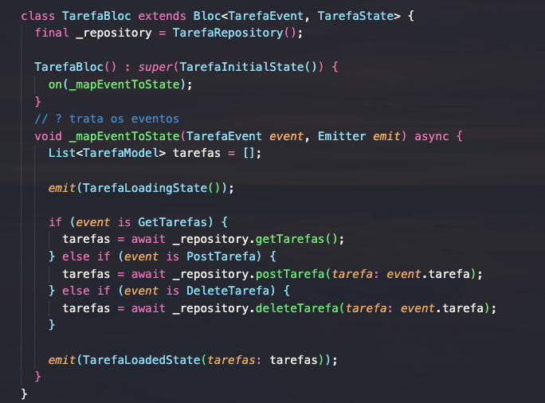
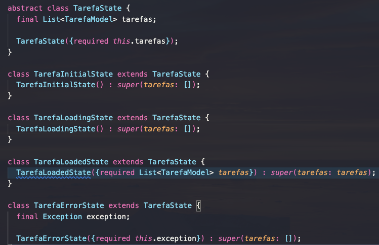
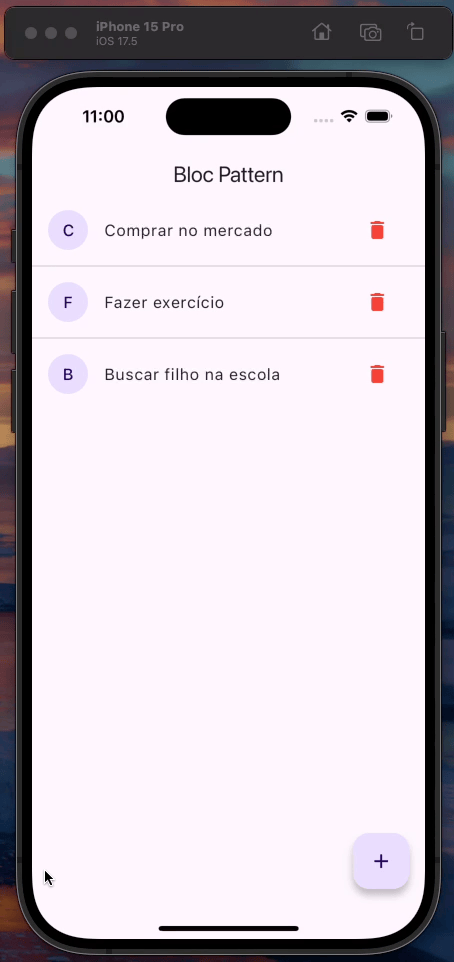

# Bloc Pattern

Projeto feito com Flutter para aprender como aplicar o padrão Bloc em projetos flutter e gerênciar estados de forma mais eficiente e organizada.

## Core

## Demonstração

### Getting Started

Para rodar o projeto na sua máquina é preciso ter algum emulador, dispositivo IOS ou Android disponível, também é necessário o SDK do flutter.
